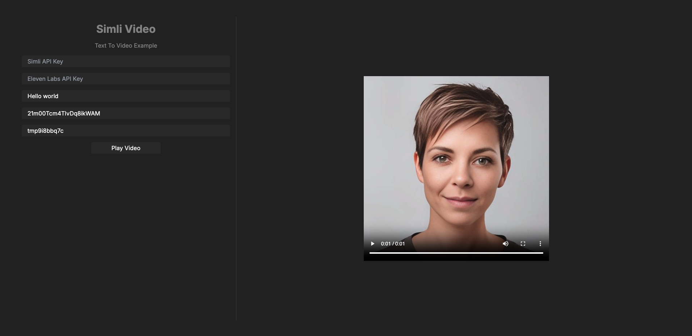

# Simli Text To Video Example

A simple text to video example using the simli API with elevenlabs voice



# Setting up

### 1. Get the Simli API key

Get the Simli API key at [Simli.com](https://simli.com/)

Get the ElevenLabs API key at [Elevenlabs.io](https://elevenlabs.io/)

### 2. Clone the repository

```
git clone https://github.com/simliai/simli_text_to_video
```

### 3. Install dependencies

```
cd simli_text_to_video
npm install
```

### 4. Run the example

```
npm run dev
```


## Notes

This example is to help you get started quickly ! If you have any questions, don't hesitate to reach out to us